# 📚 Banco de Preguntas - Documentación

## Descripción General

El **Banco de Preguntas** es una funcionalidad que permite crear y gestionar preguntas diagnósticas de forma independiente, sin necesidad de asociarlas inmediatamente a una prueba específica. Esto facilita la reutilización de preguntas en múltiples pruebas.

## Conceptos Clave

### ¿Qué es el Banco de Preguntas?
- Es un repositorio de preguntas **sin prueba asignada** (`id_prueba = null`)
- Las preguntas pueden ser creadas, editadas y almacenadas para uso futuro
- Permite reutilizar preguntas en múltiples pruebas diagnósticas

### Ventajas
✅ **Reutilización**: Una pregunta puede usarse en múltiples pruebas  
✅ **Organización**: Mantén un catálogo centralizado de preguntas  
✅ **Eficiencia**: No necesitas recrear preguntas similares  
✅ **Flexibilidad**: Asigna o clona preguntas según necesites  

---

## Endpoints Disponibles

### 1. 📋 Listar Banco de Preguntas
**GET** `/prueba_diagnostica/preguntas/banco/`

Lista todas las preguntas que no están asociadas a ninguna prueba.

**Query Parameters:**
- `tipo_pregunta` (opcional): Filtrar por tipo (`multiple`, `verdadero_falso`)

**Ejemplo de Request:**
```http
GET /prueba_diagnostica/preguntas/banco/?tipo_pregunta=multiple
Authorization: Bearer <token>
```

**Ejemplo de Response:**
```json
[
  {
    "id_pregunta": 15,
    "id_prueba": null,
    "texto_pregunta": "¿Cuál es la capital de Francia?",
    "tipo_pregunta": "multiple",
    "puntaje": "1.00",
    "imagen": null,
    "explicacion": "París es la capital de Francia desde 1789",
    "estado": true,
    "fecha_creacion": "2025-12-11T22:00:00Z",
    "en_banco": true,
    "respuestas": [
      {
        "id_respuesta": 45,
        "texto_respuesta": "París",
        "es_correcta": true,
        "fecha_creacion": "2025-12-11T22:00:00Z"
      },
      {
        "id_respuesta": 46,
        "texto_respuesta": "Londres",
        "es_correcta": false,
        "fecha_creacion": "2025-12-11T22:00:00Z"
      }
    ]
  }
]
```

---

### 2. ➕ Crear Pregunta en el Banco
**POST** `/prueba_diagnostica/preguntas/crear-con-respuestas/`

Crea una nueva pregunta en el banco (sin asignarla a una prueba).

**Request Body:**
```json
{
  "id_prueba": null,
  "texto_pregunta": "¿Qué es Python?",
  "tipo_pregunta": "multiple",
  "puntaje": 1.0,
  "explicacion": "Python es un lenguaje de programación de alto nivel",
  "respuestas": [
    {
      "texto_respuesta": "Un lenguaje de programación",
      "es_correcta": true
    },
    {
      "texto_respuesta": "Una serpiente",
      "es_correcta": false
    },
    {
      "texto_respuesta": "Un framework",
      "es_correcta": false
    }
  ]
}
```

**Response:** `201 CREATED`
```json
{
  "id_pregunta": 20,
  "id_prueba": null,
  "texto_pregunta": "¿Qué es Python?",
  "en_banco": true,
  ...
}
```

---

### 3. 🔗 Asignar Pregunta del Banco a una Prueba
**POST** `/prueba_diagnostica/preguntas/asignar-a-prueba/`

Asigna una pregunta existente del banco a una prueba específica. **La pregunta se mueve del banco a la prueba** (ya no estará disponible en el banco).

**Request Body:**
```json
{
  "id_pregunta": 15,
  "id_prueba": 3
}
```

**Response:** `200 OK`
```json
{
  "id_pregunta": 15,
  "id_prueba": 3,
  "texto_pregunta": "¿Cuál es la capital de Francia?",
  "en_banco": false,
  ...
}
```

**⚠️ Importante:**
- La pregunta ya NO estará en el banco después de asignarla
- Si quieres mantener la pregunta en el banco, usa `clonar-del-banco`

---

### 4. 📋 Clonar Pregunta del Banco a una Prueba
**POST** `/prueba_diagnostica/preguntas/clonar-del-banco/`

Crea una **copia** de una pregunta del banco (incluyendo sus respuestas) y la asigna a una prueba. **La pregunta original permanece en el banco**.

**Request Body:**
```json
{
  "id_pregunta": 15,
  "id_prueba": 3
}
```

**Response:** `201 CREATED`
```json
{
  "id_pregunta": 21,
  "id_prueba": 3,
  "texto_pregunta": "¿Cuál es la capital de Francia?",
  "en_banco": false,
  ...
}
```

**✅ Ventajas:**
- La pregunta original (id: 15) sigue en el banco
- Se crea una nueva pregunta (id: 21) asignada a la prueba
- Puedes reutilizar la misma pregunta en múltiples pruebas

---

## Flujos de Trabajo Comunes

### Flujo 1: Crear Banco de Preguntas y Reutilizar

```mermaid
graph LR
    A[Crear pregunta sin prueba] --> B[Pregunta en Banco]
    B --> C{¿Cómo usar?}
    C -->|Asignar| D[Mover a Prueba]
    C -->|Clonar| E[Copiar a Prueba]
    E --> B
```



**Pasos:**
1. Crear preguntas en el banco (con `id_prueba: null`)
2. Cuando necesites usar una pregunta:
   - **Opción A**: Asignarla (se mueve del banco)
   - **Opción B**: Clonarla (se copia, original permanece)

### Flujo 2: Convertir Pregunta de Prueba a Banco

Para mover una pregunta de una prueba al banco:

**PATCH** `/prueba_diagnostica/preguntas/{id}/`
```json
{
  "id_prueba": null
}
```

---

## Casos de Uso

### 📝 Caso 1: Profesor creando un banco de preguntas
Un profesor quiere crear 50 preguntas sobre Python para usar en diferentes pruebas durante el semestre.

**Solución:**
1. Crear las 50 preguntas con `id_prueba: null`
2. Para cada prueba, clonar las preguntas relevantes
3. Las preguntas originales permanecen en el banco

### 📝 Caso 2: Reutilizar preguntas entre módulos
Algunas preguntas básicas son útiles para múltiples módulos.

**Solución:**
1. Mantener preguntas genéricas en el banco
2. Clonarlas a las pruebas de diferentes módulos
3. Modificar las copias según sea necesario

### 📝 Caso 3: Crear versiones de una prueba
Necesitas crear 3 versiones de la misma prueba con preguntas similares.

**Solución:**
1. Crear las preguntas en el banco
2. Clonar las mismas preguntas a las 3 pruebas
3. Ajustar el orden o pequeños detalles en cada versión

---

## Diferencias: Asignar vs Clonar

| Característica | Asignar | Clonar |
|---------------|---------|--------|
| **Endpoint** | `/asignar-a-prueba/` | `/clonar-del-banco/` |
| **Pregunta original** | Se mueve a la prueba | Permanece en banco |
| **Nueva pregunta** | No se crea | Se crea una copia |
| **ID pregunta** | Mismo ID | Nuevo ID |
| **Uso recomendado** | Pregunta única | Reutilización múltiple |

---

## Validaciones y Restricciones

### ✅ Validaciones Implementadas

1. **Asignar a prueba:**
   - La pregunta debe estar en el banco (`id_prueba = null`)
   - Si ya está asignada, retorna error 400

2. **Clonar:**
   - No hay restricciones, puedes clonar cualquier pregunta
   - Se clonan también todas las respuestas

3. **Crear en banco:**
   - Debe tener al menos una respuesta correcta
   - Solo una respuesta puede ser correcta

---

## Ejemplos de Código (Frontend)

### Listar preguntas del banco
```javascript
async function obtenerBancoPreguntas() {
  const response = await fetch(
    '/prueba_diagnostica/preguntas/banco/?tipo_pregunta=multiple',
    {
      headers: {
        'Authorization': `Bearer ${token}`
      }
    }
  );
  const preguntas = await response.json();
  return preguntas;
}
```

### Clonar pregunta a una prueba
```javascript
async function clonarPregunta(idPregunta, idPrueba) {
  const response = await fetch(
    '/prueba_diagnostica/preguntas/clonar-del-banco/',
    {
      method: 'POST',
      headers: {
        'Authorization': `Bearer ${token}`,
        'Content-Type': 'application/json'
      },
      body: JSON.stringify({
        id_pregunta: idPregunta,
        id_prueba: idPrueba
      })
    }
  );
  const preguntaClonada = await response.json();
  return preguntaClonada;
}
```

---

## Resumen de Endpoints

| Método | Endpoint | Descripción |
|--------|----------|-------------|
| GET | `/preguntas/banco/` | Listar banco de preguntas |
| POST | `/preguntas/crear-con-respuestas/` | Crear pregunta (con `id_prueba: null`) |
| POST | `/preguntas/asignar-a-prueba/` | Mover pregunta del banco a prueba |
| POST | `/preguntas/clonar-del-banco/` | Copiar pregunta del banco a prueba |
| PATCH | `/preguntas/{id}/` | Actualizar pregunta (ej: mover a banco) |

---

## Notas Adicionales

- El campo `en_banco` en la respuesta indica si la pregunta está en el banco (`true`) o asignada a una prueba (`false`)
- Las preguntas del banco no afectan el conteo de preguntas de ninguna prueba
- Puedes filtrar preguntas del banco por tipo usando el query parameter `tipo_pregunta`
